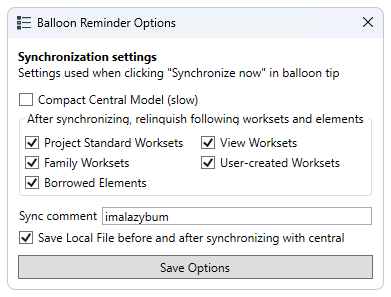

# pk_BalloonReminder

__Toggle button for a custom [pyRevit](https://github.com/eirannejad/pyRevit) extension.__

## Description
- This button replaces standard Saving and Synchronization reminder
  by less annoying balloon tip in the top-right corner of Revit:

  

- It also has the options window (Shift-Click) for Synchronization settings:

  

- If you need help with adding this button into your pyRevit extension you can find it [here](https://github.com/eirannejad/pyRevit#get-started-developing-for-pyrevit)
